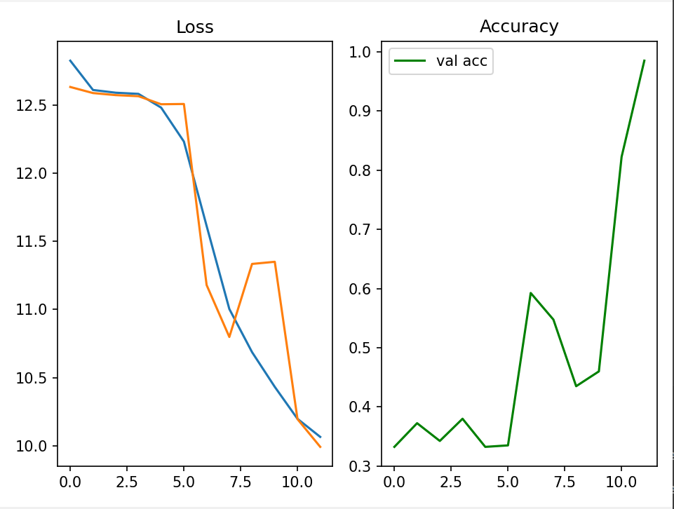
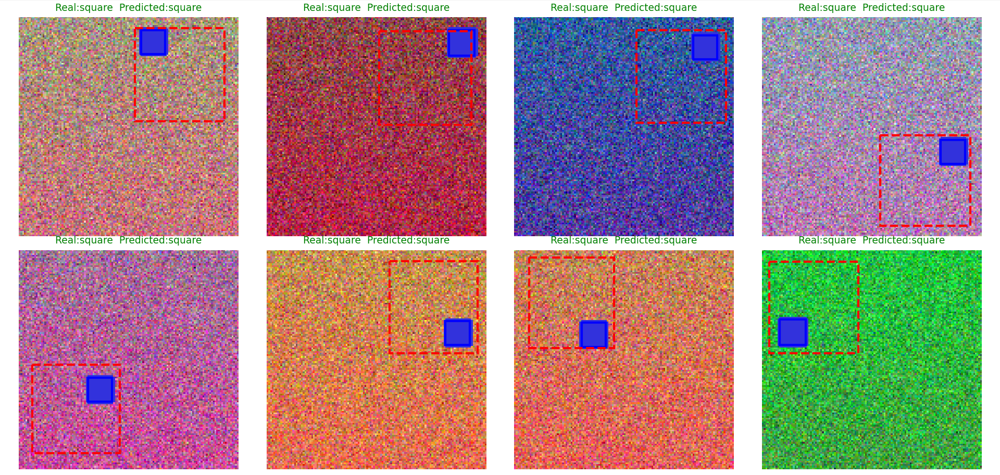
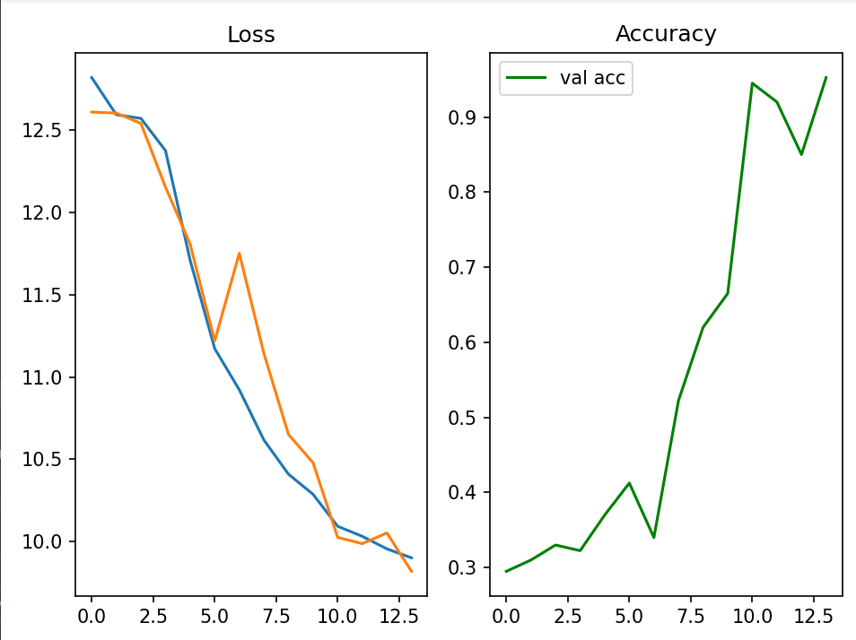
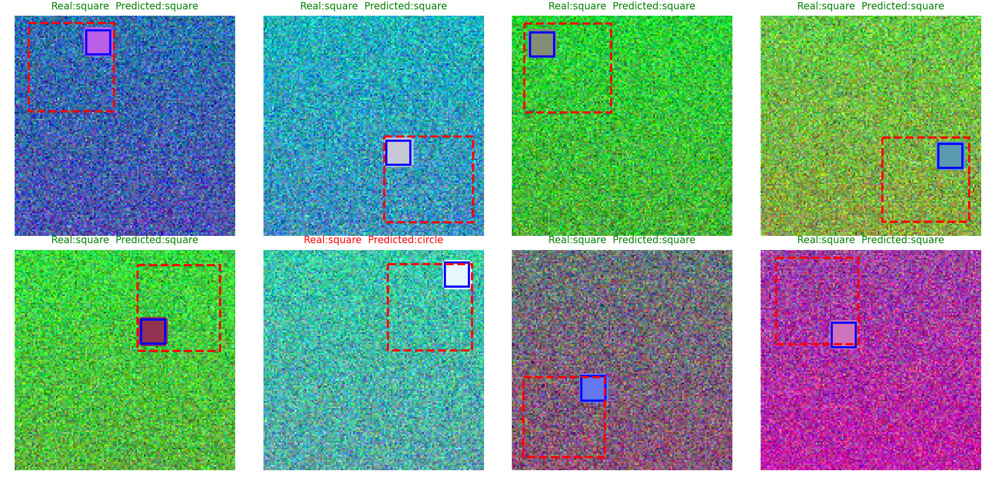
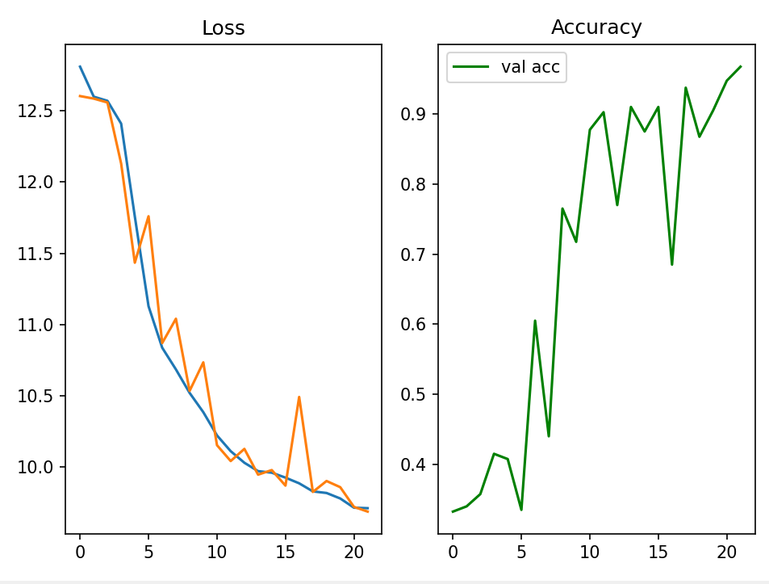
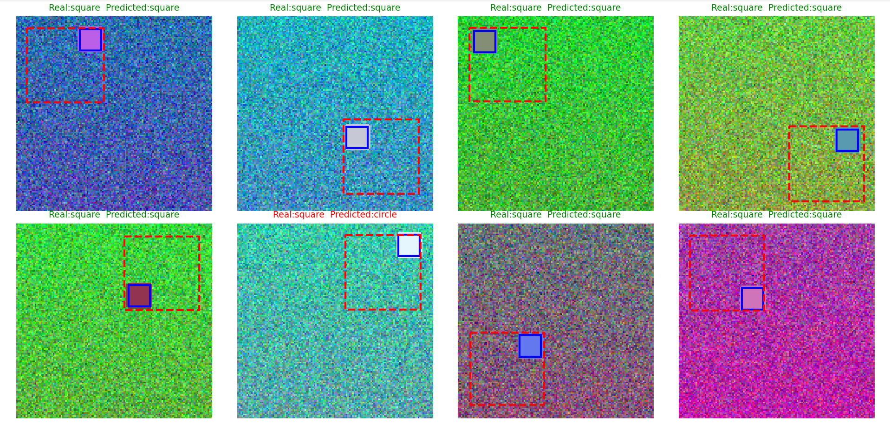

# Отчет по задаче Simple Object Detection

| Датасет | Эпохи | Accuracy (val) | Качество BBox |
| :--- | :---: | :---: | :--- |
| **shapes_dataset** | 18 | > 0.98 | Высокое 
| **shapes_dataset_bg** | 14 | ~ 0.96 | Средне |
| **shapes_dataset_random** | 22 | ~ 0.97 | Высокое  |

Первый датасет 18 эпох

Второй датасет 14 эпох

Третий датасет 22 эпох

Разница в обучении вызвана визуальным шумом, который затрудняет поиск контуров. Однако архитектура раздельными головами позволяет модели игнорировать мусор и точно находить объекты на любом фоне.

Итог: Модель  устойчива к шуму.